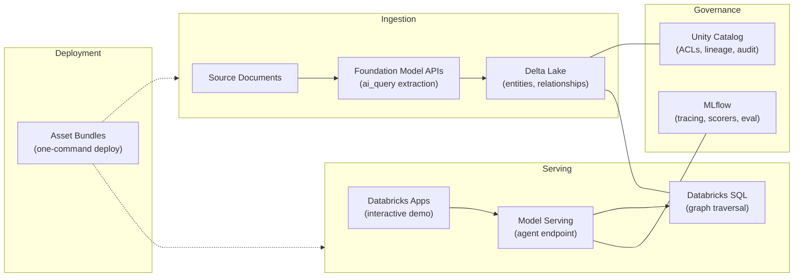

# GraphRAG: Why Your AI Can't Show Its Work — and How to Fix It

*A thought-leadership perspective for enterprise AI leaders on structured retrieval, auditable reasoning, and eliminating the integration tax.*

---

Every executive deploying AI in 2026 has heard the same question from their compliance team, their board, or their regulator:

**"Why did the AI say that?"**

It's not a philosophical question. The EU AI Act mandates explainability for high-risk systems. NIST's AI Risk Management Framework requires traceability. The OCC and FFIEC expect financial institutions to demonstrate that AI-driven decisions are auditable and reproducible. These aren't future concerns — they are current deployment blockers.

And yet, the dominant architecture for grounding LLMs in enterprise data — Retrieval-Augmented Generation (RAG) — cannot answer this question.

## The Problem with Traditional RAG

Standard RAG works by converting documents into embedding vectors, storing them in a vector database, and retrieving the most "similar" chunks when a user asks a question. The LLM then generates an answer from those chunks.

This approach improves relevance over a raw LLM. But it introduces three problems that enterprise governance cannot tolerate:

**No reasoning path.** Embedding similarity is a mathematical ranking — it tells you which chunks scored highest, but not *how* the answer was assembled from them. When a compliance officer asks "show me the chain of reasoning," the system has nothing to show. The retrieval step is a black box.

**Non-deterministic results.** Vector similarity searches can return different chunks depending on index state, query embedding drift, and ranking thresholds. The same question asked twice may yield different supporting evidence — and therefore different answers. For regulated environments, this isn't a minor annoyance; it's a disqualifying flaw.

**Opaque hallucination.** When an LLM invents a connection between two entities, there is no structural mechanism to detect it. The model may cite real sources while fabricating the relationship between them. Traditional RAG has no way to distinguish a grounded claim from a plausible-sounding hallucination.

Microsoft's GraphRAG research (2024) demonstrated that flat retrieval consistently fails on multi-hop synthesis questions — queries that require connecting information across multiple documents. But the deeper issue isn't just accuracy. It's that flat RAG *cannot prove it didn't hallucinate*, even when it gets the right answer.

## The Methodology: Graph-Structured Retrieval

GraphRAG replaces opaque embedding retrieval with structured graph traversal. The approach has three phases:

**Phase 1: Build the knowledge graph.** An LLM reads source documents and extracts entities (people, places, events, concepts, organizations) and the relationships between them (reports-to, supplies, depends-on, located-in). These become nodes and edges in a knowledge graph — a structured map of the domain.

**Phase 2: Traverse, don't search.** When a user asks a question, the agent doesn't rank chunks by similarity. Instead, it identifies the relevant entities and follows explicit paths through the graph — one hop, two hops, three hops — connecting them through named relationships. The path *is* the reasoning.

**Phase 3: Structured provenance.** Every answer includes three auditable components:

- **Path** — the explicit entity-to-entity chain traversed, with relationship types and source citations at each step
- **Sources** — every document reference used as evidence
- **Grounding** — a declaration of whether all claims are backed by graph traversal, or whether any rely on general knowledge

Here is a concrete example. A user asks: *"How is Ruth connected to Jesus?"*

A traditional RAG system might answer: *"Ruth is mentioned in Matthew's genealogy of Jesus."* Ask it to prove the connection step by step, and it cannot.

GraphRAG returns:

> **Path:** Ruth &rarr; Boaz (MARRIED_TO, Ruth 4:13) &rarr; Obed (FATHER_OF, Ruth 4:17) &rarr; Jesse (FATHER_OF, Ruth 4:22) &rarr; David &rarr; ... &rarr; Jesus (Matthew 1:16)
>
> **Sources:** Ruth 4:13, Ruth 4:17, Ruth 4:22, Matthew 1:5-6, Matthew 1:16
>
> **Grounding:** All claims backed by knowledge graph traversal

Every link in the chain is named, typed, and cited. An auditor can verify each step independently. The same query will traverse the same path every time, because graph structure is deterministic.

## Built on Databricks: Every Layer Is Native

Architecture matters as much as methodology. Many GraphRAG prototypes stitch together five or six different systems — a vector database here, a graph database there, an external LLM API, a separate auth layer, a custom deployment pipeline. Each integration point adds cost, latency, security surface, and governance gaps.

This implementation runs entirely on Databricks. Every layer uses a native platform capability, which means every layer inherits the same governance model, the same access controls, and the same operational tooling. Here is what that looks like in practice:

**Unity Catalog** governs the knowledge graph. Entity, relationship, and provenance tables are registered assets with row-level and column-level access control, cross-workspace lineage tracking, and audit logging. An enterprise can restrict who sees which entities or relationships by team, role, or data classification — without bolting on a separate ACL system for a graph database.

**Delta Lake** stores the graph. Entities and relationships live in Delta tables with ACID transactions, guaranteeing that the graph is always consistent — no partial extraction writes, no orphaned edges. Delta's time-travel capability enables reproducibility at the storage level: you can query the knowledge graph as it existed at any prior version. Schema evolution handles new entity and relationship types without migration scripts.

**Foundation Model APIs** power the extraction. Entity and relationship extraction runs through Databricks-hosted Llama 3.3 70B via `ai_query()` with structured output format. Data never leaves the Databricks environment — critical for regulated industries handling PII, PHI, or classified information. At 90-900x less cost than equivalent GPT-4 API calls, extraction is economically viable even for large corpora.

**Model Serving** hosts the agent. The GraphRAG agent is deployed as a Model Serving endpoint with auto-scaling, token-level cost tracking, and A/B testing built in. Any downstream application — web UI, internal tool, Slack bot, or API consumer — can call it through a standard REST endpoint. No separate inference infrastructure to provision or maintain.

**MLflow** provides the evaluation and observability layer. Four governance scorers — hallucination detection, citation completeness, provenance chain validation, and reproducibility — run through `mlflow.genai.evaluate()`. Full tracing captures every tool call, every LLM invocation, and every graph traversal for a complete per-query audit trail. Enterprises already operating MLflow for traditional ML models can extend their existing evaluation workflows to GenAI without retooling.

**Databricks SQL** executes graph traversal. The agent's tools — entity lookup, connection discovery, multi-hop path tracing, evidence retrieval, entity summarization, and cross-book entity search — execute Spark SQL against the Delta tables. Serverless SQL warehouses scale to zero when idle and burst for concurrent users. The same query engine that powers BI dashboards powers knowledge graph traversal.

**Databricks Apps** hosts the interactive demo. The web application deploys as a Databricks App with platform-managed OAuth, HTTPS, and hosting. The app inherits the user's Unity Catalog permissions — no separate authentication layer to build or maintain.

**Databricks Asset Bundles** deploy everything. The full solution — pipeline notebooks, agent deployment, and web application — deploys with a single `databricks bundle deploy` command. Version-controlled, multi-environment (dev/staging/prod), and promotable with a configuration swap rather than a re-architecture.

The strategic point is not that each feature is impressive in isolation. It's that **no external services are required**. No Neo4j license. No OpenAI API key. No separate auth system. No separate deployment pipeline. Every component runs on the same platform with the same governance model. For enterprises that have spent years building integration layers between disparate AI tools, this is the difference between a prototype and a production system.

## The Enterprise Benefits — With Evidence

To validate these claims, we ran a rigorous evaluation using MLflow `genai.evaluate()` with a Claude Sonnet 4.6 judge across 20 ground-truth questions. The results reveal a structural gap that no amount of model scaling can close.

### Auditability: The Provenance Gap Is Binary

Every GraphRAG answer includes a structured provenance section: the entity path traversed, the source documents cited, and a grounding indicator. A governance scorer validates that each response contains all three components.

The results are stark. In our evaluation, **zero percent** of non-GraphRAG configurations produced structured provenance chains:

| Configuration | Provenance Chain Score |
|---|---|
| GraphRAG + 70B | Structured audit trail (path, sources, grounding) |
| Flat RAG + 70B | **0%** — no provenance structure |
| Direct LLM + 70B (Llama 3.3 70B) | **0%** — no provenance structure |
| Direct External (GPT-5.2) | **7.5%** — occasional partial structure |

This is not a quality gap that improves with better models or more data. It is a structural impossibility: without a knowledge graph to traverse, there is no path to show. A frontier model costing 10x more per token still cannot produce an audit trail.

### Hallucination Resistance: Correctness Without Proof Is Liability

The hallucination check scorer validates whether factual claims are traceable to the source corpus (all 66 books of the King James Bible). Here is where the data gets uncomfortable:

| Configuration | Correctness | Hallucination Check (% passing) |
|---|---|---|
| Direct LLM + 70B | **80%** | **15%** |
| Direct External (GPT-5.2) | 70% | 75% |
| Flat RAG + 70B | 20% | 65% |

The Direct LLM (Llama 3.3 70B, no retrieval) scores highest on correctness at 80% — but only **15% of its responses pass the hallucination check**. That means 85% of responses contain claims that cannot be verified against the source data. In a regulated environment, an answer that is correct but unprovable is indistinguishable from a hallucination.

The frontier model (GPT-5.2) does better at 75% hallucination pass rate, but at significantly higher cost — and still cannot produce structured provenance. Flat RAG is the worst of both worlds: low correctness (20%) and mediocre hallucination resistance (65%).

GraphRAG structurally constrains reasoning to graph evidence. When the agent cannot find a connection through graph traversal, the system prompt requires it to explicitly flag that a claim relies on general knowledge rather than grounded data. This transforms hallucination from an invisible failure mode into a measurable, auditable one.

### Reproducibility: Determinism by Design

Graph traversal is deterministic. The same query traverses the same edges and returns the same path. A reproducibility test suite runs five representative queries three times each, validating that paths and citations are consistent across runs. Traditional embedding retrieval cannot make this guarantee because vector similarity rankings shift with index updates and query embedding variance.

### Cost: The Secondary Benefit That Closes the Business Case

Governance is the primary value. But cost seals the deal:

| Endpoint | Input ($/1M tokens) | Output ($/1M tokens) |
|---|---|---|
| Llama 3.3 70B (Databricks) | $1.00 | $1.00 |
| Llama 3.1 8B (Databricks) | $0.075 | $0.30 |
| GPT-5.2 (External via Databricks) | $2.50 | $10.00 |
| GPT-4 Turbo (OpenAI direct) | $10.00 | $30.00 |

GraphRAG on Databricks Foundation Model APIs delivers auditable, governed responses at a fraction of external LLM pricing. The 8B model option — which maintains governance structure at even lower cost — makes it economical to run governance-compliant AI at scale. Delta-native storage eliminates graph database licensing entirely. The total cost of ownership drops not because any single component is cheaper, but because the integration tax disappears.

## Evaluation: Measuring What Matters

Governance claims are only credible if they are measurable. The evaluation framework compares five configurations head-to-head on 20 ground-truth questions using MLflow's GenAI evaluation with Claude Sonnet 4.6 as the judge model:

| Configuration | Retrieval Method | Model | What It Proves |
|---|---|---|---|
| GraphRAG + 70B | Graph traversal | Llama 3.3 70B | Full auditable reasoning |
| GraphRAG + 8B | Graph traversal | Llama 3.1 8B | Governance holds with smaller, cheaper models |
| Flat RAG + 70B | Embedding similarity | Llama 3.3 70B | Best-case traditional RAG (no provenance) |
| Direct LLM + 70B | None | Llama 3.3 70B | Ungrounded parametric baseline |
| Direct External | None | GPT-5.2 | Frontier model baseline |

Two scorecard categories separate signal from noise:

**Governance scorecards** measure what regulators care about — hallucination rates, citation completeness, provenance chain integrity, and cross-run reproducibility. These are the metrics that determine whether a system is deployable in a regulated environment.

**Quality scorecards** measure what users care about — answer correctness, relevance, grounded reasoning depth, and multi-hop reasoning quality.

Here are the quality results across the baseline configurations, evaluated on 20 multi-hop and cross-book questions:

| Configuration | Correctness | Grounded Reasoning | Multi-hop Reasoning | Relevance |
|---|---|---|---|---|
| Direct External (GPT-5.2) | 70% | 100% | 85% | 100% |
| Direct LLM + 70B | 80% | 95% | 75% | 100% |
| Flat RAG + 70B | 20% | 80% | 60% | 100% |

The pattern is revealing. The most expensive model (GPT-5.2) and the ungrounded Llama 70B both produce reasonable answers — but neither can prove those answers are grounded. Flat RAG, despite having access to the actual source documents via embedding retrieval, scores worst on correctness. Embedding similarity retrieves *related* content, not *the right* content for multi-hop questions that require connecting facts across multiple documents.

The framework is designed to be domain-portable. Swap the evaluation dataset and scorer criteria for your domain — financial regulations, medical literature, legal precedent — and the same measurement infrastructure applies.

## From Demo to Production

This implementation uses the complete King James Bible as a demo corpus — all 66 books with their dense, cross-referencing network of people, places, and events where lineage connections are independently verifiable. But the architecture is domain-agnostic.

For enterprise deployment, the same pattern applies directly:

| Bible Domain | Financial Services | Healthcare | Software Architecture |
|---|---|---|---|
| Person (Moses) | Client, Counterparty | Patient, Provider | Service, Module |
| Place (Egypt) | Market, Jurisdiction | Facility, Department | Cluster, Region |
| Event (Exodus) | Trade, Filing | Diagnosis, Procedure | Incident, Release |
| FAMILY_OF | COUNTERPARTY_TO | REFERRED_BY | DEPENDS_ON |
| *"How is Ruth connected to Jesus?"* | *"What is our exposure chain to this counterparty?"* | *"What treatment pathway led to this outcome?"* | *"What services break if this schema changes?"* |

The roadmap extends the foundation: Delta tables (current) evolve to Lakebase for OLTP-speed graph lookups, then to dedicated graph engines for complex traversal algorithms. Hybrid retrieval combines graph traversal with vector search for questions that benefit from both structured reasoning and semantic similarity. Incremental ingestion adds new documents to the graph without full re-extraction.

## The New Standard for Enterprise AI

The question facing enterprise AI leaders is no longer *"Can we build an AI that answers questions?"* That problem is solved. The question is *"Can we build an AI that answers questions in a way our compliance team, our regulators, and our customers can trust?"*

Traditional RAG cannot answer that question. It retrieves by similarity, reasons in a black box, and produces answers that are neither reproducible nor auditable.

GraphRAG can. It retrieves by structure, reasons along explicit paths, and produces answers with a verifiable chain of evidence. Built natively on Databricks, it does this without the integration tax — no external graph databases, no external LLM APIs, no separate governance layers.

AI systems that can show their work are not a nice-to-have. In regulated industries, they are a deployment prerequisite. GraphRAG is the pattern that makes deployment possible.

---

*This post is based on the [GraphRAG Solution Accelerator](https://github.com/databricks/GraphRAG), an open-source implementation on Databricks. The full pipeline — from knowledge graph construction through agent deployment and governance evaluation — is available for immediate use.*
