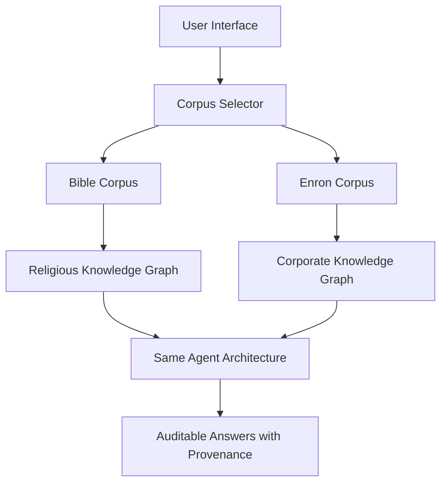
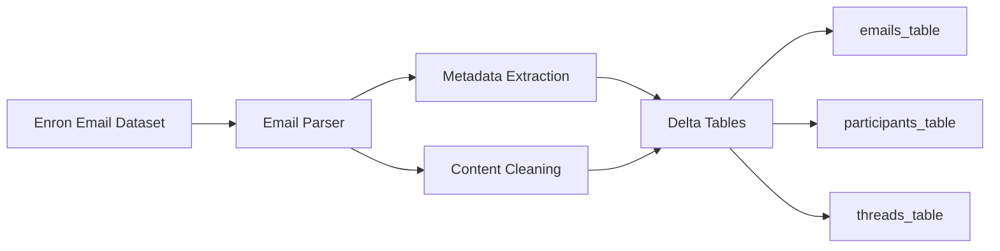
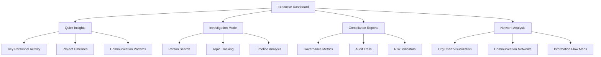

# Enron Dataset Integration Plan for GraphRAG Solution Accelerator

## Executive Summary

This plan outlines how to integrate the Enron email dataset into the existing GraphRAG Solution Accelerator to create an immediately compelling enterprise demonstration that showcases auditable AI reasoning for corporate governance, compliance, and investigation use cases on the Databricks platform.

## Current Architecture Analysis

### Existing Components (Bible Corpus)
- **Data Pipeline**: [`notebooks/01_Data_Prep.py`](../notebooks/01_Data_Prep.py) - Loads structured text into Delta tables
- **Knowledge Graph**: [`notebooks/02_Build_Knowledge_Graph.py`](../notebooks/02_Build_Knowledge_Graph.py) - Uses [`ai_query()`](../src/extraction/extraction.py) for entity/relationship extraction
- **Agent**: [`src/agent/`](../src/agent/) - LangGraph agent with graph traversal tools
- **Web App**: [`src/app/`](../src/app/) - Dash application with demo interface
- **Evaluation**: [`notebooks/05_Evaluation.py`](../notebooks/05_Evaluation.py) - Governance scorers and MLflow evaluation

### Integration Points Identified
1. **Configuration Layer**: [`src/config.py`](../src/config.py) - Add Enron corpus settings
2. **Data Ingestion**: Extend existing pipeline for email processing
3. **Extraction Prompts**: [`src/extraction/extraction.py`](../src/extraction/extraction.py) - Corporate entity types
4. **Demo Interface**: [`src/app/pages/live_demo.py`](../src/app/pages/live_demo.py) - Business-focused questions
5. **Evaluation Framework**: Corporate governance metrics

## Strategic Integration Approach

### Phase 1: Dual-Corpus Architecture
Create a **corpus selector** that allows users to switch between Bible (academic) and Enron (enterprise) demonstrations, showing the same GraphRAG technology applied to different domains.



### Phase 2: Business Value Demonstration
Focus on **immediate business impact** scenarios that non-technical executives can understand:

#### Corporate Governance Use Cases
1. **"Who was involved in the California energy trading decisions?"**
   - Shows organizational accountability and decision tracing
2. **"What projects did Jeff Skilling work on between 2000-2001?"**
   - Demonstrates personnel activity tracking and timeline analysis
3. **"How did information flow about the Broadband division?"**
   - Reveals communication patterns and information dissemination

#### Compliance & Investigation Scenarios
1. **"Which executives discussed Fastow's partnerships?"**
   - Tracks sensitive topic discussions across the organization
2. **"What meetings were scheduled around earnings announcements?"**
   - Identifies potential coordination around material events
3. **"Who had access to financial projections before public disclosure?"**
   - Maps information access and potential insider knowledge

## Implementation Strategy

### 1. Data Ingestion Pipeline for Enron Emails

#### Email Processing Architecture


#### New Delta Tables
- **`emails_table`**: Individual email records with metadata
- **`participants_table`**: People and their organizational roles
- **`threads_table`**: Email conversation threads
- **`corporate_entities_table`**: Companies, divisions, projects
- **`corporate_relationships_table`**: Business relationships and hierarchies

### 2. Corporate Entity Extraction

#### Enhanced Entity Types for Business Context
```python
CORPORATE_ENTITY_TYPES = [
    "Person",           # Ken Lay, Jeff Skilling, Andy Fastow
    "Organization",     # Enron, Arthur Andersen, Vinson & Elkins
    "Division",         # Broadband, Trading, International
    "Project",          # California Energy, Dabhol Power
    "Meeting",          # Board meetings, strategy sessions
    "Document",         # Contracts, reports, presentations
    "Location",         # Houston, Portland, London offices
    "Financial_Event",  # Earnings, acquisitions, partnerships
]
```

#### Corporate Relationship Types
```python
CORPORATE_RELATIONSHIPS = [
    "REPORTS_TO",       # Organizational hierarchy
    "COLLABORATES_WITH", # Cross-functional work
    "MANAGES",          # Project/division management
    "PARTICIPATES_IN",  # Meeting/project participation
    "CREATES",          # Document authorship
    "REFERENCES",       # Document citations
    "LOCATED_AT",       # Geographic relationships
    "OWNS",             # Asset ownership
    "PARTNERS_WITH",    # Business partnerships
]
```

### 3. Non-Technical User Interface Design

#### Executive Dashboard Features


#### Business-Focused Demo Flows

**Flow 1: Executive Accountability**
1. **Question**: "Show me Ken Lay's involvement in California energy decisions"
2. **Response**: Structured timeline with email evidence
3. **Provenance**: Complete audit trail from question to source emails
4. **Business Value**: Demonstrates accountability and decision tracing

**Flow 2: Risk Assessment**
1. **Question**: "Who knew about Fastow's partnerships before they were disclosed?"
2. **Response**: Network of informed individuals with timeline
3. **Provenance**: Email threads and meeting records as evidence
4. **Business Value**: Shows information access patterns for compliance

**Flow 3: Operational Intelligence**
1. **Question**: "How did the Broadband division communicate with leadership?"
2. **Response**: Communication patterns and reporting structures
3. **Provenance**: Email flows and organizational relationships
4. **Business Value**: Reveals operational effectiveness and information flow

### 4. Enhanced Web Application Structure

#### New Page: Corporate Demo
```python
# src/app/pages/corporate_demo.py
CORPORATE_EXAMPLE_QUESTIONS = [
    "Who was involved in the California energy trading decisions?",
    "What projects did Jeff Skilling manage between 2000-2001?",
    "How did information flow about the Broadband division?",
    "Which executives discussed Fastow's partnerships?",
    "What meetings were scheduled around earnings announcements?",
    "Who had access to financial projections before disclosure?",
]
```

#### Enhanced Navigation
```python
NAV_ITEMS = [
    {"label": "Understand", "children": [
        {"href": "/", "icon": "fa-home", "text": "Home"},
        {"href": "/how-it-works", "icon": "fa-cogs", "text": "How It Works"},
        {"href": "/architecture", "icon": "fa-sitemap", "text": "Architecture"},
    ]},
    {"label": "Experience", "children": [
        {"href": "/academic-demo", "icon": "fa-book", "text": "Academic Demo (Bible)"},
        {"href": "/corporate-demo", "icon": "fa-building", "text": "Corporate Demo (Enron)"},
        {"href": "/comparison", "icon": "fa-balance-scale", "text": "Side-by-Side Comparison"},
    ]},
    {"label": "Adopt", "children": [
        {"href": "/apply", "icon": "fa-briefcase", "text": "Apply to Business"},
        {"href": "/governance", "icon": "fa-shield-alt", "text": "Governance & Compliance"},
    ]},
]
```

### 5. Governance & Compliance Metrics

#### Corporate-Specific Scorers
```python
CORPORATE_GOVERNANCE_SCORERS = [
    "email_citation_completeness",    # Are claims backed by specific emails?
    "timeline_accuracy",              # Are dates and sequences correct?
    "participant_verification",       # Are all mentioned people verified?
    "organizational_consistency",     # Do reporting structures match?
    "information_access_audit",       # Who had access to what information?
]
```

#### Executive Reporting Dashboard
- **Auditability Score**: Percentage of answers with complete provenance
- **Citation Coverage**: Fraction of claims backed by email evidence
- **Timeline Accuracy**: Consistency of temporal relationships
- **Network Completeness**: Coverage of organizational relationships

## Deployment Strategy

### Configuration Updates
```python
# src/config.py additions
config['enron_corpus'] = {
    'emails_table': f"{config['catalog']}.{config['schema']}.enron_emails",
    'participants_table': f"{config['catalog']}.{config['schema']}.enron_participants",
    'corporate_entities_table': f"{config['catalog']}.{config['schema']}.enron_entities",
    'corporate_relationships_table': f"{config['catalog']}.{config['schema']}.enron_relationships",
}

config['demo_mode'] = 'dual'  # 'bible', 'enron', or 'dual'
```

### Databricks Asset Bundle Updates
```yaml
# deploy/enron_pipeline.yml
resources:
  jobs:
    enron_pipeline:
      name: "GraphRAG Enron Pipeline"
      tasks:
        - task_key: "enron_data_prep"
          notebook_task:
            notebook_path: "./notebooks/01_Enron_Data_Prep"
        - task_key: "enron_knowledge_graph"
          notebook_task:
            notebook_path: "./notebooks/02_Enron_Knowledge_Graph"
          depends_on:
            - task_key: "enron_data_prep"
```

## Business Impact Messaging

### For C-Suite Executives
**"See how GraphRAG makes AI decisions auditable and traceable - essential for enterprise governance and compliance. Every answer shows its work with complete provenance chains."**

### For Compliance Officers
**"Transform your investigation capabilities with AI that provides complete audit trails. Track information flow, verify claims, and ensure regulatory compliance with transparent reasoning."**

### For IT Leaders
**"Deploy enterprise-grade AI with built-in governance on Databricks. GraphRAG provides the auditability and traceability that traditional RAG cannot deliver."**

### For Data Scientists
**"See the technical architecture that makes auditable AI possible. Compare GraphRAG performance against traditional approaches with comprehensive evaluation metrics."**

## Success Metrics

### Technical Metrics
- **Extraction Accuracy**: Entity/relationship precision on Enron emails
- **Query Performance**: Response time for corporate questions
- **Provenance Completeness**: Percentage of answers with full audit trails

### Business Metrics
- **Demo Engagement**: Time spent in corporate vs academic demos
- **Use Case Resonance**: Which corporate scenarios generate most interest
- **Adoption Intent**: Conversion from demo to business discussions

### Governance Metrics
- **Auditability Score**: Comprehensive provenance chain coverage
- **Compliance Readiness**: Regulatory audit trail completeness
- **Risk Identification**: Ability to surface compliance concerns

## Next Steps

1. **Immediate**: Create Enron data ingestion notebook
2. **Week 1**: Implement corporate entity extraction prompts
3. **Week 2**: Build corporate demo interface
4. **Week 3**: Deploy dual-corpus architecture
5. **Week 4**: Create executive dashboard and reporting

This integration will transform the GraphRAG Solution Accelerator from an academic demonstration into a compelling enterprise showcase that immediately communicates business value to non-technical stakeholders while maintaining technical depth for practitioners.